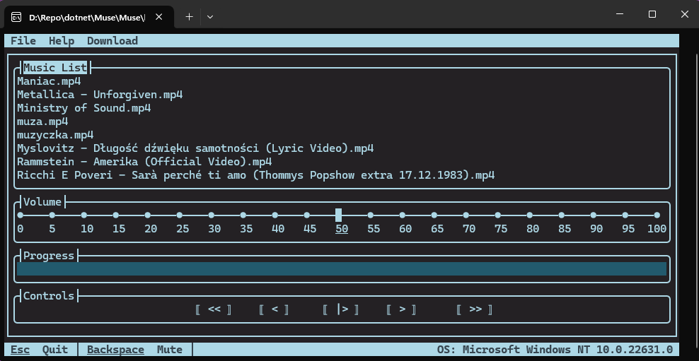

# Muse 🎵

Muse is terminal music player built with Terminal.Gui and NAudio on .NET platform.

## Screenshots 📷


## Features 🎉
Muse is a simple TUI music player that allows you to play music directly from your terminal.
If you do not want to use Spotify, YouTube Music, or similar services, and instead prefer listening to music stored on your local drive through a terminal application with a clean interface and convenient shortcuts, then Muse is the right tool for you.

## Installation 📦
To install muse use this command:
```bash
dotnet tool install --global Muse
```

App is still under development, so update frequently:
```bash
dotnet tool update --global Muse
```

# Contributing 🤝
If you want to contribute to this project, feel free to do so. I am open to any suggestions and improvements.